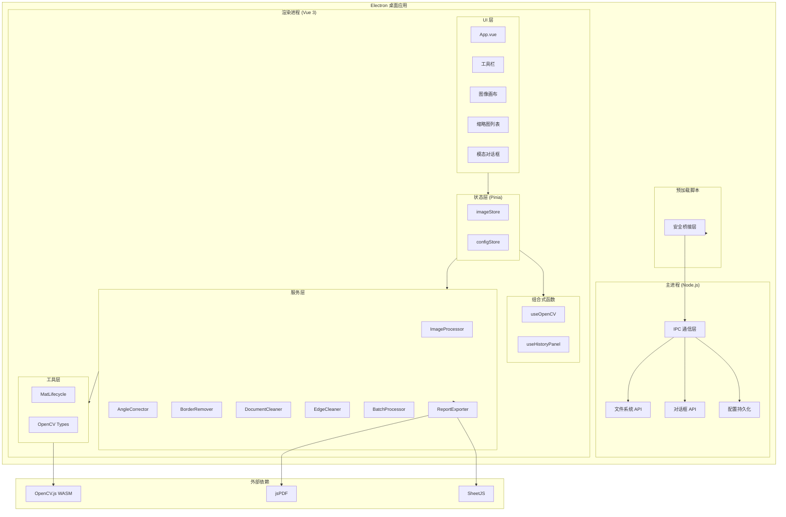
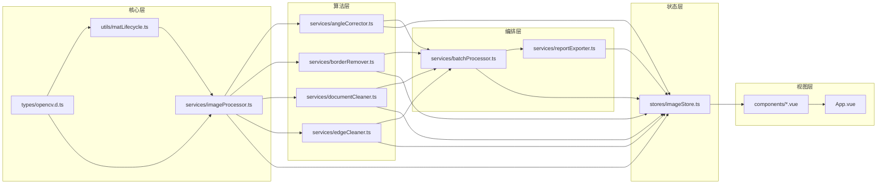
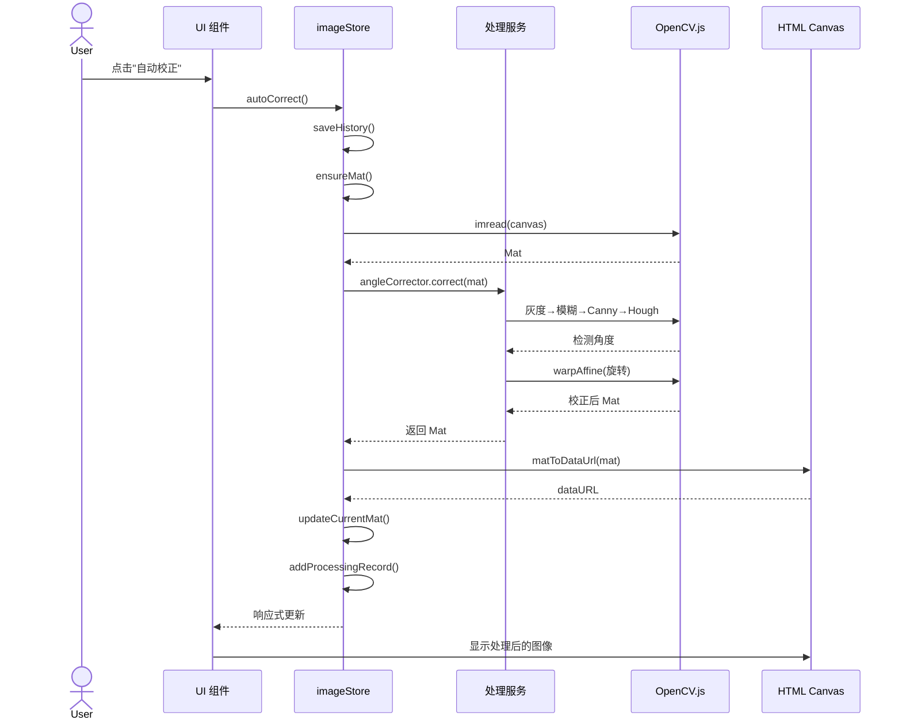
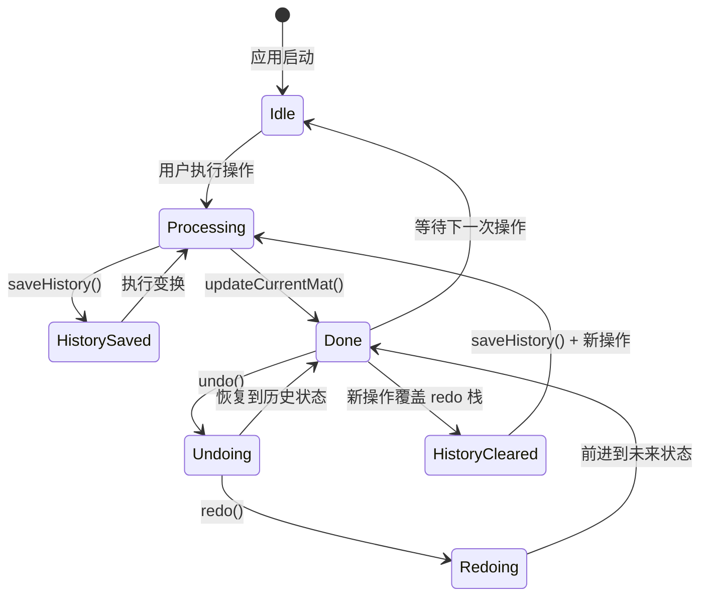
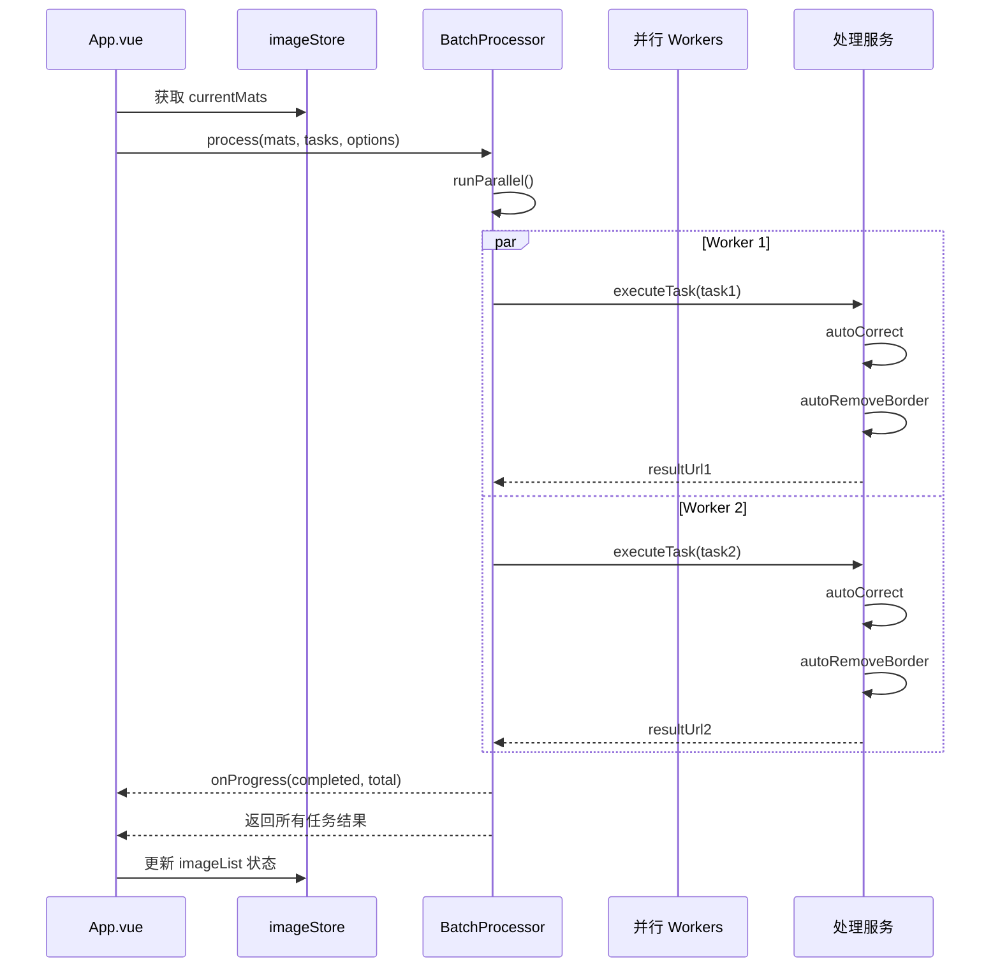
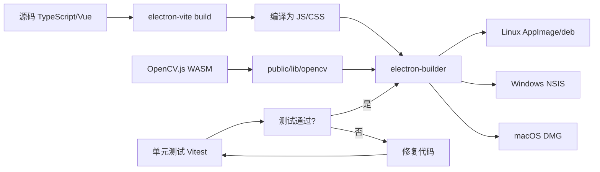
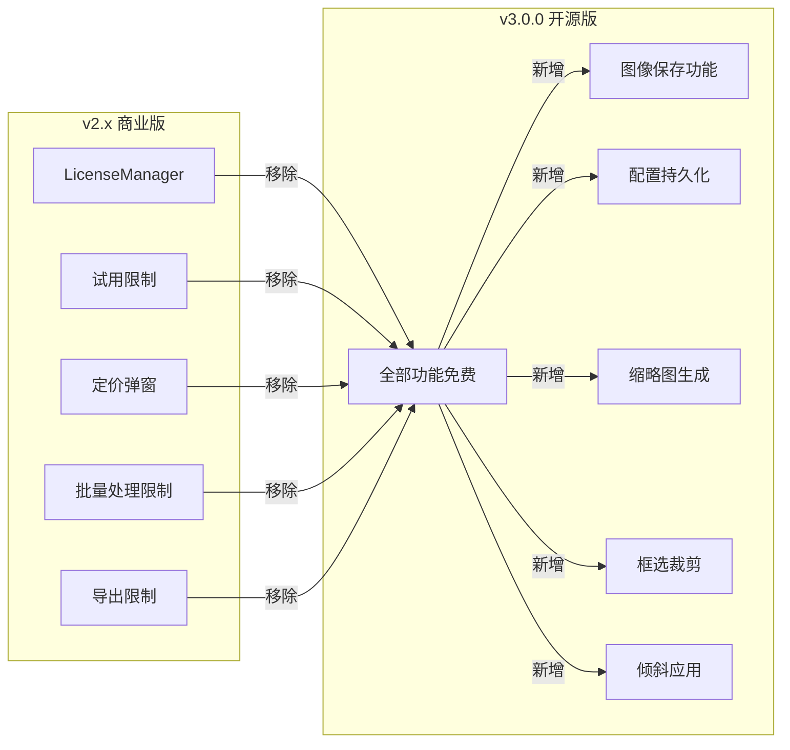

# 架构图集 — img2easy v3.0.0 (开源版)

> 基于 Mermaid 的系统架构描述

---

## 1. 系统架构图

---

## 2. 模块依赖图

---

## 3. 图像处理数据流

---

## 4. 撤销/重做状态机

---

## 5. 批量处理时序

---

## 6. 构建流程图

---

## 7. 开源化改造范围

---

*文档版本: 3.0.0*
*最后更新: 2026-05-11*
